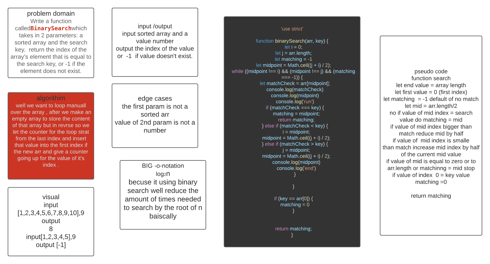

# Array binary search
<!-- Short summary or background information -->
Write a function called arraybinary which takes an array  and a value as args. Without utilizing any of the built-in methods available to your language, return the index of the value in the array and -1 if it doesn't exist.

## Challenge
<!-- Description of the challenge -->
using the idea of binary search to look for the number in the array while keep giving the expected value at the edges of the index's and returning it without getting in an infinte loop .

## Approach & Efficiency
<!-- What approach did you take? Why? What is the Big O space/time for this approach? -->
First find the mid point of the arr.length
then check if value of the number in that index
is less or bigger than key value of it is bigger 
ignore all bigger numbers if it is less ignore all 
lower index's keep doing until the value of the 
index is equal to the key value and return it
  or key value does
not exist .then return -1

## Solution
<!-- Embedded whiteboard image -->
