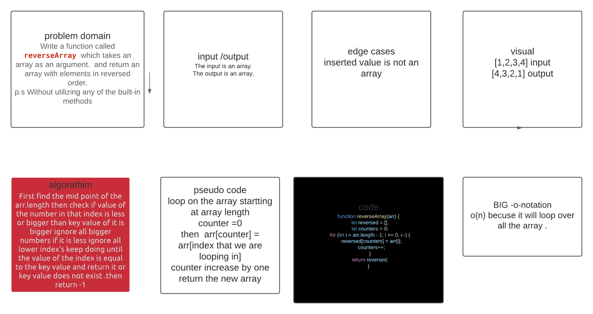

# Reverse an Array
<!-- Short summary or background information -->
Write a function called reverseArray which takes an array as an argument. Without utilizing any of the built-in methods available to your language, return an array with elements in reversed order.

## Challenge
<!-- Description of the challenge -->
reversing the array Without utilizing any of the built-in methods available to your language, return an array with elements in reversed order.

## Approach & Efficiency
<!-- What approach did you take? Why? What is the Big O space/time for this approach? -->
well we want to loop manuall over the array , after we make an empty array to store the content of that array but in revrse so we let the counter for the loop strat from the last index and insert that value into the first index if the new arr and give a counter going up for the value of it's index .
## Solution
<!-- Embedded whiteboard image -->
