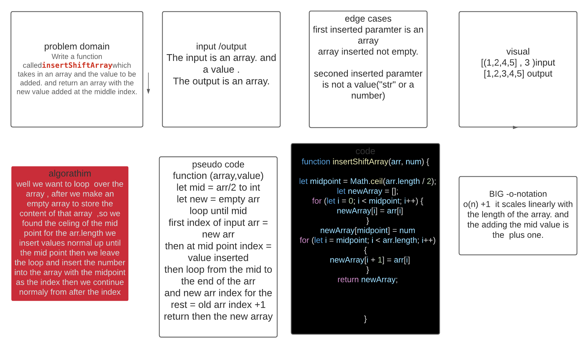

## Challenge
<!-- Short summary or background information -->
Write a function called insertShiftArray which takes in an array and the value to be added. Without utilizing any of the built-in methods available to your language, return an array with the new value added at the middle index.

## Approach & Efficiency
<!-- What approach did you take? Why? What is the Big O space/time for this approach? -->
well we want to loop  over the array , after we make an empty array to store the content of that array  ,so we found the celing of the mid point for the arr.length we insert values normal up until the mid point then we leave the loop and insert the number into the array with the midpoint as the index then we continue normaly from after the index
## Solution
<!-- Embedded whiteboard image -->
