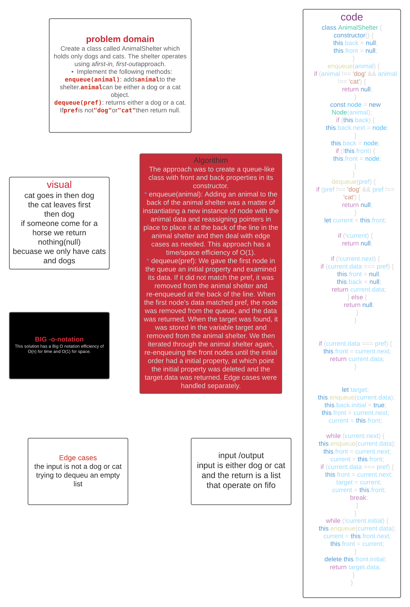

# FIFO Animal Shelter
Insert and shift an array in middle at index.

## Challenge
* Create a class called AnimalShelter which holds only dogs and cats. The shelter operates using a first-in, first-out approach.
* Implement the following methods:
  * enqueue(animal): adds animal to the shelter. animal can be either a dog or a cat object.
  * dequeue(pref): returns either a dog or a cat. If pref is not "dog" or "cat" then return null.

## Approach & Efficiency
* Our approach was to create a queue-like class with front and back properties in its constructor.
* enqueue(animal): Adding an animal to the back of the animal shelter was a matter of instantiating a new instance of node with the animal data and reassigning pointers in place to place it at the back of the line in the animal shelter and then deal with edge cases as needed. This approach has a time/space efficiency of O(1).
* dequeue(pref): We gave the first node in the queue an initial property and examined its data. If it did not match the pref, it was removed from the animal shelter and re-enqueued at the back of the line. When the first node's data matched pref, the node was removed from the queue, and the data was returned. When the target was found, it was stored in the variable target and removed from the animal shelter. We then iterated through the animal shelter again, re-enqueuing the front nodes until the initial order had a initial property, at which point the initial property was deleted and the target.data was returned. Edge cases were handled separately.

This solution has a Big O notation efficiency of O(n) for time and O(1) for space.

## UML

