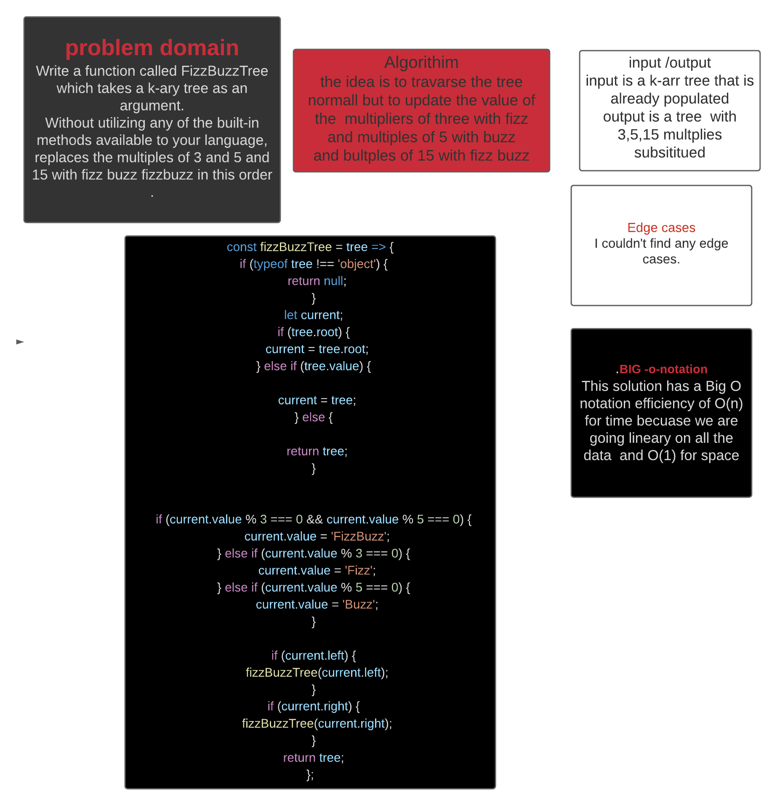

# TREE
<!-- Short summary or background information -->
Write a function called FizzBuzzTree which takes a k-ary tree as an argument.
Without utilizing any of the built-in methods available to your language, replaces the multiples of 3 and 5 and 15 with fizz buzz fizzbuzz in this order .
## Challenge
<!-- Short summary or background information -->
The challenge is to be able to travarse a k-arry tree and replaces the multiples of 3 and 5 and 15 with fizz buzz fizzbuzz in this order .
## Approach & Efficiency
<!-- What approach did you take? Why? What is the Big O space/time for this approach? -->
I believe by traversing the binary tree normal at each node i will just check the  value of the of that node if it is higher than the value i have stored already i will take it then return what i have after i finish traversing .
- Searching for the maximmum  node will  be O(n).

## Whiteboared
