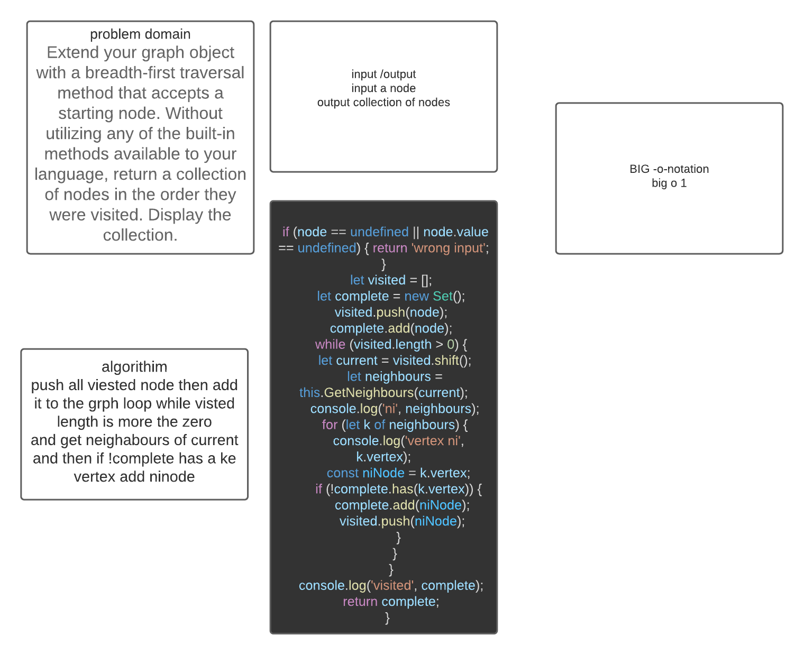

# Graphs
 Implement a breadth-first traversal on a graph.

## Challenge
 Extend your graph object with a breadth-first traversal method that accepts a starting node. Without utilizing any of the built-in methods available to your language, return a collection of nodes in the order they were visited. Display the collection.

## Approach & Efficiency
 O (n)

## Solution

