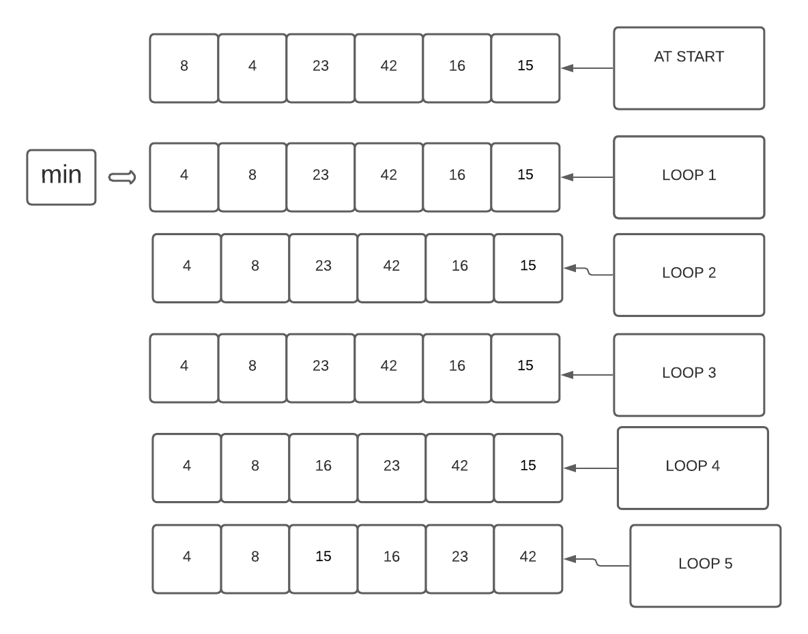

# INSERTION Sort

The approach  was to check all the numbers in the array from left to right, the first one has nothing to it's left so exclude it the seconed one has only one if it,s bigget than it you assign the value of one of them to a temp variable so you won't lose it 
then swap them at the third one you need to check it with the two numbers before it that why we used a while loop .
The big 0 of time insertion sorting is equal to (n*(n+1))/2 but we drop the constants so it is On^2.however space complexty.

