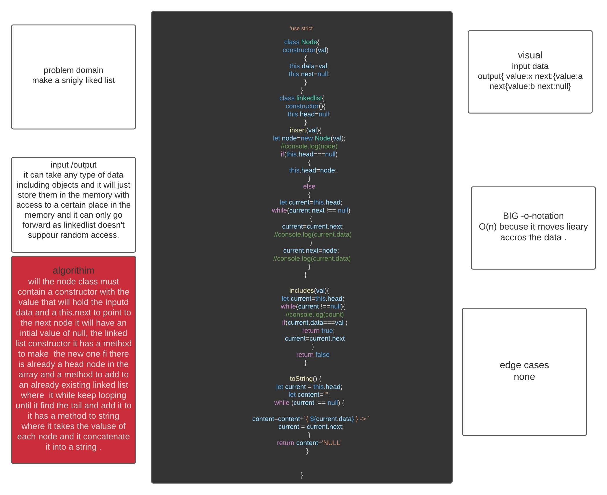

# Singly Linked List
<!-- Short summary or background information -->
linked list  is a type of data structures ,singly in particualry is a type that contains a node with a value and  a pointer that points to the next place in the memory. 
## Challenge
<!-- Short summary or background information -->
Write two classes one to instantiate a new node and one to instantiate a new linkedlist type data structure the node has one pointer so it is a singly type linkedlist if it had two it would have been doubly.
## Approach & Efficiency
<!-- What approach did you take? Why? What is the Big O space/time for this approach? -->
will the node class must contain a constructor with the value that will hold the inputd data and a this.next to point to the next node it will have an intial value of null, the linked list constructor it has a method to make  the new one fi there is already a head node in the array and a method to add to an already existing linked list where  it while keep looping until it find the tail and add it to it has a method to string where it takes the valuse of each node and it concatenate it into a string .

## Solution
<!-- Embedded whiteboard image -->

