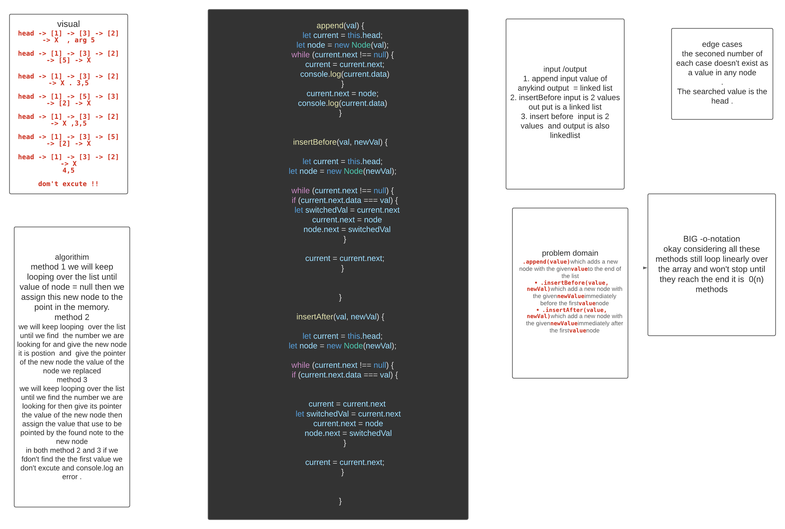

# Singly Linked List
<!-- Short summary or background information -->
linked list  is a type of data structures ,singly in particualry is a type that contains a node with a value and  a pointer that points to the next place in the memory. 
## Challenge
<!-- Short summary or background information -->
write 3 methods one to append new  ndoe to the end of the list and one to append a node before a certain value and one to append it after a certain value it wont excute the latter two if the value that is being searched is not there .
## Approach & Efficiency
<!-- What approach did you take? Why? What is the Big O space/time for this approach? -->
method 1 we will keep looping over the list until value of node = null then we  assign this new node to the point in the memory.method 2we will keep looping  over the list until we find  the number we are looking for and give the new node it is postion  and  give the pointer of the new node the value of the node we replacedmethod 3we will keep looping over the list until we find the number we are looking for then give its pointer the value of the new node then  assign the value that use to be pointed by the found note to the new node  in both method 2 and 3 if we fdon't find the the first value we don't excute and console.log an error .

## Solution
<!-- Embedded whiteboard image -->

