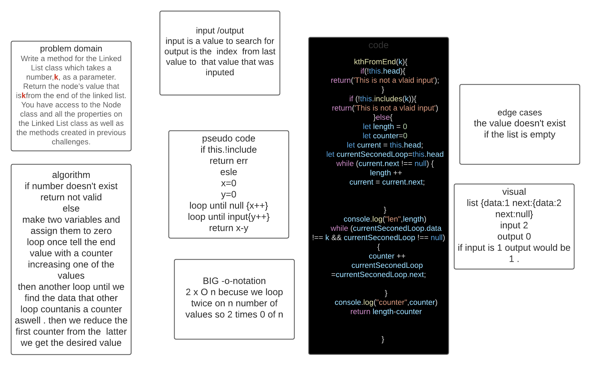

# Singly Linked List
<!-- Short summary or background information -->
linked list  is a type of data structures ,singly in particualry is a type that contains a node with a value and  a pointer that points to the next place in the memory. 
## Challenge
<!-- Short summary or background information -->
write 1 method that takes a number and returns the value of the index from the last postion rather than the first like a normal index . the challenge was that linked list can only go forward .
## Approach & Efficiency
<!-- What approach did you take? Why? What is the Big O space/time for this approach? -->

f number doesn't exist return not validelse make two variables and assign them to zero loop once tell the end value with a counter increasing one of the values then another loop until we find the data that other loop countanis a counteraswell . then we reduce the first counter from the  latter we get the desired value
## Solution
<!-- Embedded whiteboard image -->

