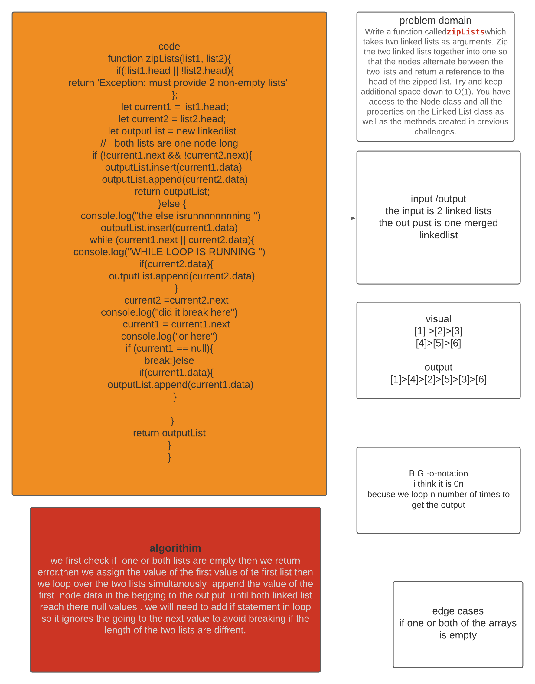

# Singly Linked List
<!-- Short summary or background information -->
linked list  is a type of data structures ,singly in particualry is a type that contains a node with a value and  a pointer that points to the next place in the memory. 
## Challenge
<!-- Short summary or background information -->
Write a function calledzipListswhich takes two linked lists as arguments. Zip the two linked lists together into one so that the nodes alternate between the two lists and return a reference to the head of the zipped list. Try and keep additional space down to O(1). You have access to the Node class and all the properties on the Linked List class as well as the methods created in previous challenges.
## Approach & Efficiency
<!-- What approach did you take? Why? What is the Big O space/time for this approach? -->
we first check if  one or both lists are empty then we return error.then we assign the value of the first value of te first list then we loop over the two lists simultanously  append the value of the first  node data in the begging to the out put  until both linked list reach there null values . we will need to add if statement in loop so it ignores the going to the next value to avoid breaking if the length of the two lists are diffrent.

## Solution
<!-- Embedded whiteboard image -->

