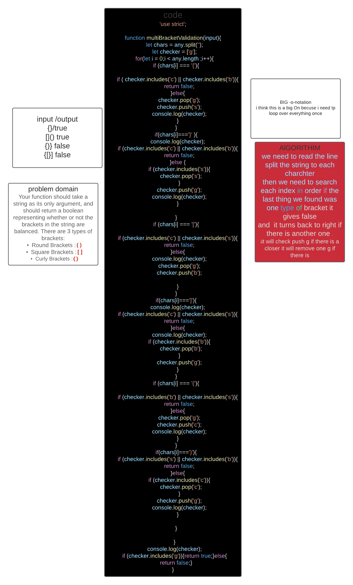

# Multi bracked validation
<!-- Short summary or background information -->
Stacks are like a box  the older stuff you add go to the bottotm and you retrive them from top to bottom first in last out,however queues are like a line (hence the name).first people in get served first First in first out . 
## Challenge
<!-- Short summary or background information -->
Your function should take a string as its only argument, and should return a boolean representing whether or not the brackets in the string are balanced. There are 3 types of brackets:
Round Brackets :()
Square Brackets :[]
Curly Brackets :{}
## Approach & Efficiency
<!-- What approach did you take? Why? What is the Big O space/time for this approach? -->
we need to read the line so maybe split the string to each charchter 
then we need to search each index in order if the last think we found was one type of bracket it gives false
and  it turns back to right if there is another one 

## Whiteboared
