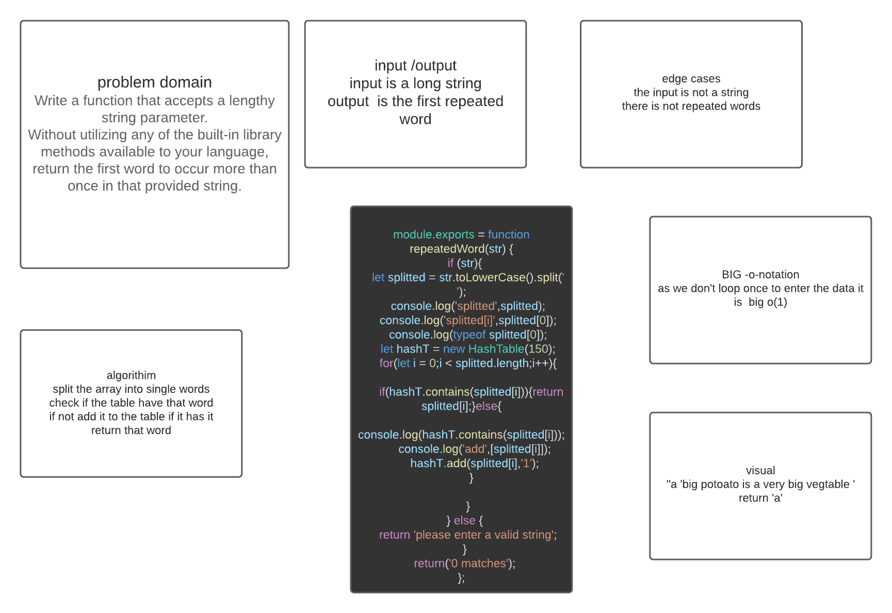

# Repeated-words
<!-- Short summary or background information -->
Write a function that accepts a lengthy string parameter.
Without utilizing any of the built-in library methods available to your language, return the first word to occur more than once in that provided string.
## Challenge
<!-- Short summary or background information -->
The challange is to get the first repeated word in a string with the best efficiency available .
## Approach & Efficiency
<!-- What approach did you take? Why? What is the Big O space/time for this approach? -->
algorithim will split the array into single words check if the table have that word if not add it to the table if it has it return that word 
- The Big O time complexity for checking for the first duplicate O(1)

## Whiteboared
