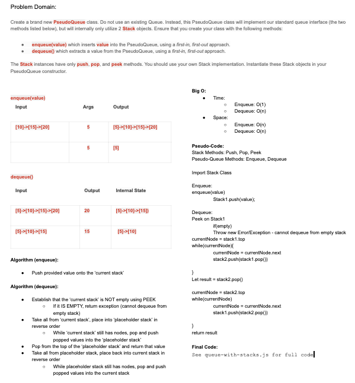

# Stacks and Queues
<!-- Short summary or background information -->
Stacks are like a box  the older stuff you add go to the bottotm and you retrive them from top to bottom first in last out,however queues are like a line (hence the name).first people in get served first First in first out . 
## Challenge
<!-- Short summary or background information -->
internally only utilize 2 Stack objects. Ensure that you create your class with the following methods:

enqueue(value) which inserts value into the PseudoQueue, using a first-in, first-out approach.
dequeue() which extracts a value from the PseudoQueue, using a first-in, first-out approach.
## Approach & Efficiency
<!-- What approach did you take? Why? What is the Big O space/time for this approach? -->

## Whiteboared
