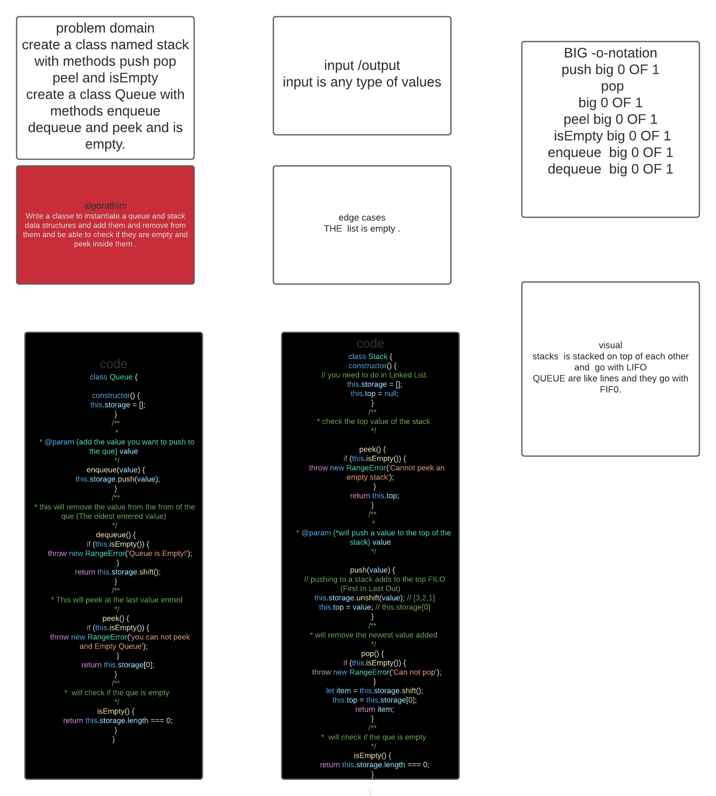

# Stacks and Queues
<!-- Short summary or background information -->
Stacks are like a box  the older stuff you add go to the bottotm and you retrive them from top to bottom first in last out,however queues are like a line (hence the name).first people in get served first First in first out . 
## Challenge
<!-- Short summary or background information -->
Write a classe to instantiate a queue and stack data structures and add them and remove from them and be able to check if they are empty and peek inside them .
## Approach & Efficiency
<!-- What approach did you take? Why? What is the Big O space/time for this approach? -->
will i belive that all the methode added today were a big O of 1 becuse they were single action that resides in one single line of code with no itrations .
1. push big 0 OF 1 
2. pop big 0 OF 1
3. peel big 0 OF 1  
4. isEmpty big 0 OF 1 
5. enqueue  big 0 OF 1
6. dequeue  big 0 OF 1

## Whiteboared
