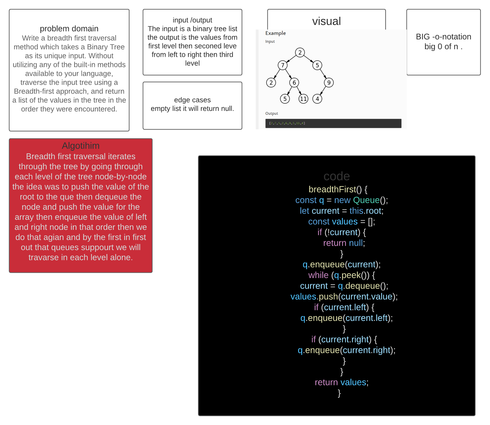

# TREE
<!-- Short summary or background information -->
Write a breadth first traversal method which takes a Binary Tree as its unique input. Without utilizing any of the built-in methods available to your language, traverse the input tree using a Breadth-first approach, and return a list of the values in the tree in the order they were encountered.
## Challenge
<!-- Short summary or background information -->
The challenge is to be able to output the values on a breadth base which means to go from value in the first level of the tree to the seconed etc ..
## Approach & Efficiency
<!-- What approach did you take? Why? What is the Big O space/time for this approach? -->
Breadth first traversal iterates through the tree by going through each level of the tree node-by-node the idea was to push the value of the root to the que then dequeue the node and push the value for the array then enqueue the value of left and right node in that order then we do that agian and by the first in first out that queues suppourt we will travarse in each level alone.
- big 0 of n WE will have to go through all the nodes in the list regardless.

## Whiteboared
