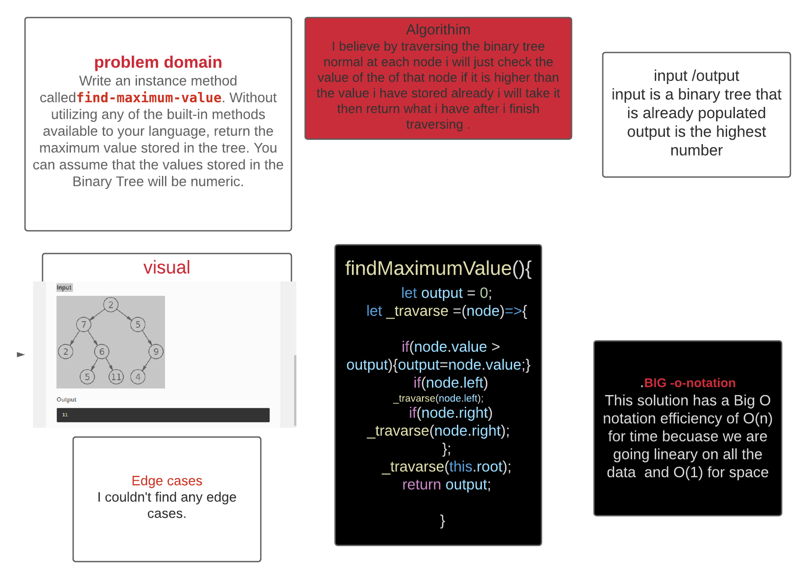

# TREE
<!-- Short summary or background information -->
Write an instance method calledfind-maximum-value. Without utilizing any of the built-in methods available to your language, return the maximum value stored in the tree. You can assume that the values stored in the Binary Tree will be numeric.
## Challenge
<!-- Short summary or background information -->
The challenge is to be able to find the maximum value of the binry tree and return it.
## Approach & Efficiency
<!-- What approach did you take? Why? What is the Big O space/time for this approach? -->
I believe by traversing the binary tree normal at each node i will just check the  value of the of that node if it is higher than the value i have stored already i will take it then return what i have after i finish traversing .
- Searching for the maximmum  node will  be O(n).

## Whiteboared
